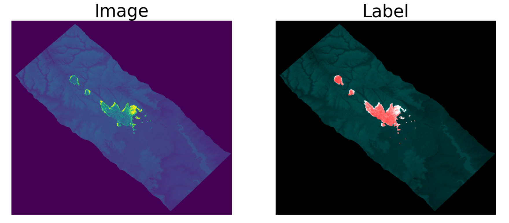

# 2021 Better Working World Data Challenge
Our Top 12%, France finalist submission to the fire mapping AI competition organized by EY

The goal of the competition was to create an AI capable of locating fires on a black and white satellite image

Here is an example:

Here is how Fabien Roger and I did it:

